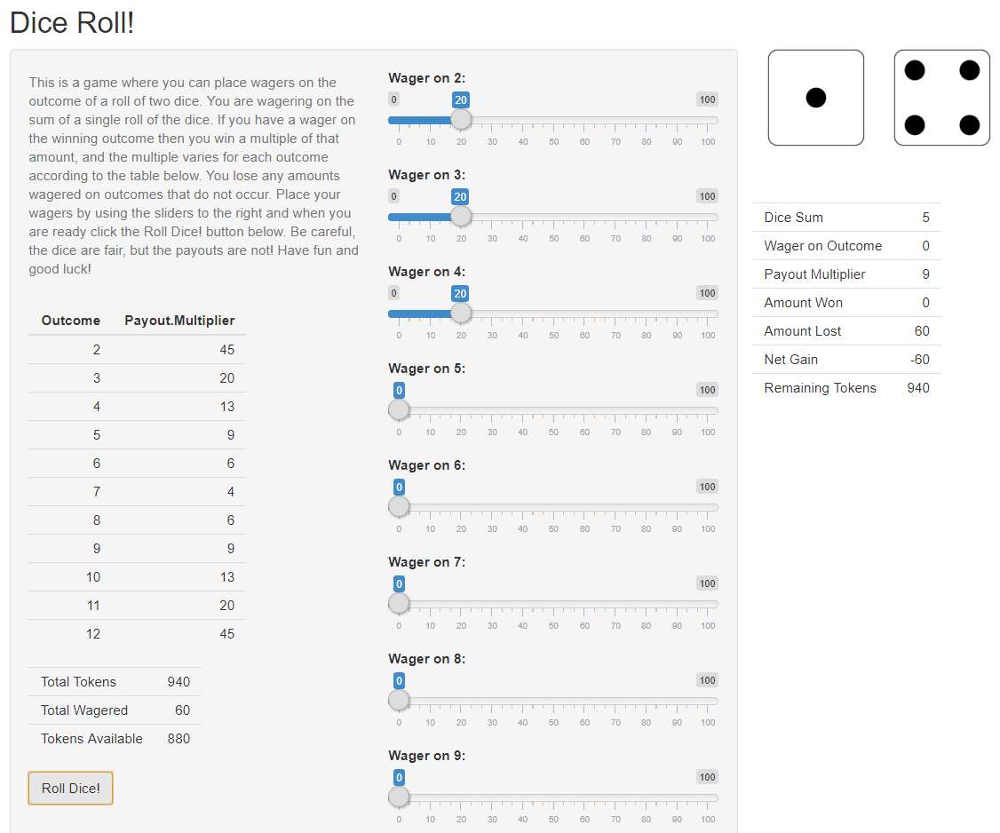

Pitch for Dice Roll! App
========================================================
author: Justin Z
date: June 12, 2019
autosize: true


Overview
========================================================

This presentation is for the week 4 peer-graded project in the Developing Data
Products course from Johns Hopkins University within the Data Science
Specialization on Coursera. The instructions say to create an application using
`shiny` and then create a presentation pitching the app.

To meet the objective an application was created which is a game where the user
can place wagers on the outcome of a roll of two dice. The `shiny` application
and this presentation were created in Rstudio.
 - The repo for the app is [here][1].
 - The app is hosted on shinyapps.io [here][2] (accessible as monthly active
 hours allow)

[1]: https://github.com/jtzingsheim1/Dice-Roll-Application "GitHub repo for app"
[2]: https://jtzingsheim.shinyapps.io/Dice_Roll_Game/  "shinyapps.io"


User Interface (Image Only)
========================================================




Server Logic
========================================================

The excerpt of the server logic code where the dice are rolled is shown below.
In a different part of the server logic, the app selects the appropriate images
to display. The actual server code for `die1` is shown below, but is not
evaluated here. The code that is run to produce the dice images on this slide is
hidden, but it is a slightly modified version of the same server code. In this
slide, just like in the actual application, the seed is intentionally not set.


```r
# Roll the dice
die1 <- sample(1:6, 1)
die2 <- sample(1:6, 1)
dice.sum <- sum(die1, die2)
```


```r
# Render the image for the first die
output$die1 <- renderImage({
    filename <- paste0("die", RollTheDice()$die1, ".png")
    filepath <- normalizePath(file.path('./die_images', filename))
    list(src = filepath, width = img.sz, height = img.sz)
}, deleteFile = FALSE)
```


Sales Pitch
========================================================

This is a good app because:
 - It is fun to play
 - It allows users to have a gambling like experience in a safe environment
 - Users can apply their statistics knowledge to exploit the payouts and win big
 - It is a creative solution to the project requirements
 
Thanks for your time, I hope you enjoyed using the app.

